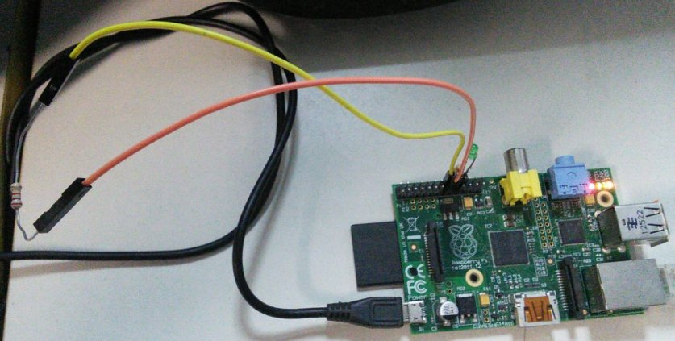

# GPIOAPI
An educational experiment on writing an erlang REST API to interface raspberry pi's GPIO, using **elli** web server and my gpio library.

After registered for use, references for gpio pins are stored in a **mnesia** table, *gpins*, and all read and write operations run over these references. 

API handling is all performed on [gpioapi_callback.erl](src/gpioapi_callback.erl), mnesia data is performed on [memory.erl](src/memory.erl) and **elli** configuration(port, callback file) on [gpioapi_sup.erl](src/gpioapi_sup.erl).


## Requirements
- **Raspbian** GNU/Linux;
- **erlang** 17+, `apt-get install erlang` solve it;
- **rebar**, to speed things up (`wget https://raw.github.com/wiki/rebar/rebar/rebar && chmod u+x rebar`);
- **elli**, An erlang web server for HTTP APIs (github.com/knutin/elli), `rebar get-deps` handles it;
- **gpio**, My gpio library (github.com/paoloo/gpio), `rebar get-deps` also solve this;
- **root**, to access "/sys/class/gpio/" files.


## Usage
- Get dependencies and compile:
```
# rebar get-deps
$ rebar compile
```
- Run application and open erlang REPL to real-time change in params:
```
$ erl -pa deps/*/ebin ebin -s gpioapi_app start
```
or, without running erlang REPL, as a deamon:
```
$ erl -detached -pa deps/*/ebin ebin -s gpioapi_app start
```


## Documentation
All functions of API are available through a *HTTP GET* method.
- To register a pin for operations, go to:
 `http://localhost:3000/register/pin/direction`
where the **pin** is the pin label(not the position) and direction is **in** for input or **out** for output;
- To write to a pin assigned as **out**, go to:
 `http://localhost:3000/write/pin/value`
where value can be **1** or **0**.
- To read from a pin assigned as **in**, go to:
 `http://localhost:3000/read/pin`
- To release a pin previously assigned, go to:
 `http://localhost:3000/unregister/pin`


## why there is no automatized test?
Because we cannot just assign random pins as input and output without the proper hardware assembly(a simple resistor between the input and output signal pins would do), but a test routine is described(and shown on image) below:

- Put a resistor between in **GPIO22** and **GPIO23**;
- Start this application;
- Register pin 22 as output by going `localhost:3000/register/22/out`;
- Register pin 23 as input by going `localhost:3000/register/23/in`;
- write 1 to pin 22 by going `localhost:3000/write/22/1`;
- read it from pin 23 by going `localhost:3000/read/23`;
- change values sent from 22 to 23 and read to confirm.


## Tested on
- Erlang/OTP 17 erts-6.2 in GNU/Linux Raspian 8.0 (jessie) kernel 4.1.19+ armv61 on Raspberry B+.
- Erlang R15B01 erts-5.9.1 in GNU/Linux Raspian 7 (wheezy) kernel 4.1.13+ armv6l on Raspberry B.


## License
[MIT License](LICENSE.md) © 2015-2016 Paolo Oliveira.